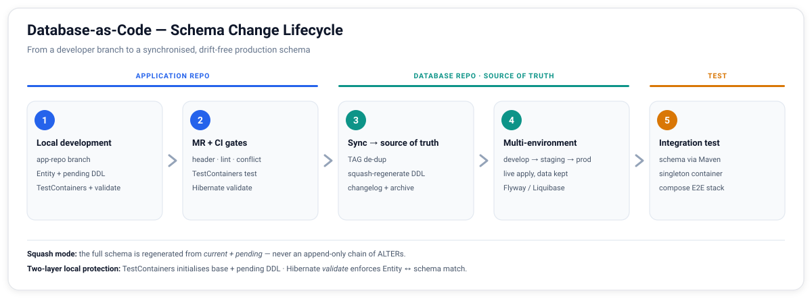

# Schema-as-Code: the change lifecycle

This document describes the full lifecycle of a database schema change, from a
developer's feature branch to a synchronised production schema. The same flow
applies to the relational store (`oracle-ddl.sql`) and the document store
(`mongo-ddl.js`).

Terminology is defined at the end.



---

## Stage 1 — Local development (application repo)

The developer changes application code and schema together on a feature branch.

### 1.1 Write the pending SQL

A change is captured as `sample-service/docs/db/<TAG>.sql` with a mandatory
header so the pipeline can route and audit it:

```sql
-- TAG: PROJ-101
-- SCHEMA: ACCOUNT
-- TYPE: DDL
-- TABLES: ACCOUNT
-- DESCRIPTION: Add STATUS flag to ACCOUNT table
-- BREAKING: N
ALTER TABLE ACCOUNT.ACCOUNT ADD (STATUS NUMBER(1) DEFAULT 0 NOT NULL);
COMMENT ON COLUMN ACCOUNT.ACCOUNT.STATUS IS 'Account status flag: 0=inactive, 1=active';
```

`BREAKING` is not decoration — `N` means the change is safe as a plain rolling
deploy (an additive column, a new table); `Y` means it isn't (a type change, a
`NOT NULL` with no default, a drop), and the change must instead be split into
the Expand–Contract sequence described in
[`expand-contract.md`](expand-contract.md) rather than shipped as one step.

**DDL vs DML scope.** DDL is mandatory for any schema change. DML in
`docs/db/` is narrow on purpose: only rows the system cannot start correctly
without — a default category, a required config row — never ordinary test
data. Test data belongs in the test itself, or in `database-repo/test-dml/`
for cross-service integration seeding (Stage 5).

### 1.2 Apply locally and adjust the Entity

The developer applies the pending SQL to their dev DB and updates the Entity so
that the `@Column` set matches the new shape.

### 1.3 Two-layer local protection

Either layer failing means the service will not start / the test will not pass:

| Layer | Mechanism | Catches |
|-------|-----------|---------|
| 1 | Testcontainers initialises the schema by replaying **every file in `docs/db/`** — the service's full ticket history, not just the new one | Missing pending SQL — the column is not in the container, the repository test fails |
| 2 | `spring.jpa.hibernate.ddl-auto=validate` | Entity `@Column` vs DDL mismatch — startup throws |

There is exactly one copy of this SQL: the build exposes `docs/db/` directly on
the test classpath (a Maven `testResources` entry, not a copy into
`src/test/resources/`), so the schema a test is checked against is the literal
file a reviewer and the Stage-3 sync also read — see
[`BaseOracleContainer`](../sample-service/src/test/java/com/example/account/BaseOracleContainer.java)
in the sample service.

If a developer changes the dev DB by hand but never writes the pending SQL, the
container is built without that change, Hibernate `validate` sees an Entity field
with no backing column, and the test fails. The omission cannot reach review.

---

## Stage 2 — Merge request + CI (application repo)

| Step | Check | Tool |
|------|-------|------|
| 1 | Header completeness (TAG / TYPE / TABLES / BREAKING required) | DB rules check (CI) |
| 1 | SQL style / syntax | SQLFluff |
| 2 | Repository tests against the full `docs/db/` history — replays **every ticket ever written for this service**, including already-synced ones; Oracle rejects any structural conflict (duplicate column, invalid `ALTER`) at execution time | Testcontainers |
| 2 | Entity/DDL match | Hibernate `validate` |
| 2 | Business logic + code quality | unit tests + SonarQube |

> **Conflict detection via execution, not static analysis.** Structural conflicts
> (e.g. adding a column that already exists after a prior ticket was synced) are
> caught at step 2: the complete ticket history is replayed through a live Oracle
> container on every PR, so any inconsistency produces a real database error rather
> than a regex miss. `docs/db/` is never cleaned up — synced tickets stay — which
> is what makes this guarantee hold.
>
> **Cross-service DDL conflicts are prevented at the architecture level.** Each
> table has exactly one owner service; all other services are read-only. This
> constraint eliminates the conflict class entirely before any tooling is involved.

A reviewer (tech lead) approves the MR. On merge, **if `docs/db/*` is
non-empty**, CI triggers the Stage 3 sync into the database repo.

---

## Stage 3 — Sync into the central schema (database repo, squash mode)

Run automatically when a change merges. For each pending file:

| Step | Action | Notes |
|------|--------|-------|
| 1 | **TAG de-dup** | If `changelog.md` already has this TAG with `RESULT=done`, record `RESULT=skip` — prevents the same change being applied twice when several services carry it |
| 2 | **Regenerate DDL (squash)** | Replay the service's *entire* `docs/db/*.sql` ticket history — the same files, the same mechanism the service's own tests already use — inside a throwaway Oracle container, then dump the resulting schema. The squashed file is never hand-maintained and never reads from a live DB |
| 3 | **Write changelog** | Append `GIT_COMMIT / TAG / DATE / RESULT / BREAKING / DESCRIPTION` |
| 4 | **Copy to `migrations/`** | A flat, synced-order archive for whole-DB audit — a copy, not a move |
| 5 | **Leave `docs/db/` alone** | It is not a staging area. The files there are the service's permanent migration history *and* its own test fixture (Stage 1); deleting a synced ticket would silently shrink the schema the service's tests are constructed from |

The central repo is organised so the whole-DB view and the per-schema view both
exist:

```
database-repo/
├── oracle-ddl.sql      # current full schema (all schemas)
├── mongo-ddl.js        # current full collections
├── changelog.md        # whole-DB migration history
├── account/            # per-schema slice
│   ├── oracle-ddl.sql
│   └── changelog.md
├── migrations/         # synced-order copy archive, for whole-DB audit
└── test-dml/           # seed DML for integration tests
```

The central schema is published to a Maven registry, versioned by branch /
environment, so downstream tests and IaC can pull an exact schema version.

---

## Stage 4 — Multi-environment deployment

The database repo's environment branches are merged on a release cadence:

```
develop → staging → production
```

Each merge applies the schema delta to that environment's **live** database
while **retaining existing data** (Flyway / Liquibase / Bytebase govern the
apply step). Staging and production always deploy from the single stable schema,
so there is no drift between environments.

---

## Stage 5 — Integration testing against the published schema

Tests pull the schema as a Maven dependency from the database repo, so they run
against exactly what production will run.

- **Per-service unit tests** — a shared **Singleton Container** (one Oracle
  container reused across test classes) keeps the suite fast.
- **Single-service integration** — that service's schema slice + `test-dml/`
  seed; external services stubbed (WireMock).
- **Cross-service E2E** — the whole stack via `docker-compose.test.yml`, run in
  an isolated environment.

---

## Protection-layer summary

| Guard | Where | Catches | Severity |
|-------|-------|---------|----------|
| Hibernate `validate` | local / CI | Entity ↔ DDL mismatch | Critical |
| Testcontainers full-history replay | local / CI | missing pending SQL; structural conflicts (duplicate ADD COLUMN, invalid ALTER) — Oracle rejects at execution time | Critical |
| Header + SQL lint | CI step 1 | malformed SQL, missing required header fields | Critical |
| Owner-service isolation | architecture | cross-service DDL conflicts — each table has exactly one owner service; others are read-only | Critical |
| TAG de-dup | sync | same change applied twice by the same service | Warning |
| Squash | post-sync | bloated schema file, slow containers | Quality |
| Forced sync on merge | MR flow | per-service change never reaching the source of truth | Critical |

---

## Terminology

| Term | Meaning |
|------|---------|
| pending SQL | A schema change in `app-repo/docs/db/`, not yet recorded as `done` in the central changelog. It does not move or get deleted once synced — `docs/db/` is the service's permanent ticket history, not a staging area |
| TAG | Change identifier, equal to the issue/ticket id, globally unique |
| BREAKING | A header flag (`Y`/`N`) marking whether a change is safe as a plain rolling deploy, or must be split via Expand–Contract |
| Squash | Regenerate one clean full schema by replaying a service's full ticket history, instead of appending `ALTER`s indefinitely |
| Snapshot | A periodic full schema dump, as needed |
| Schema drift | The live DB's actual schema differs from the version-controlled definition |

---

## CI portability note

The gates described here map directly onto
GitLab CI (the platform's native tooling): the `lint`/`header`/`conflict` jobs
become a `test` stage, the TestContainers job a `test` stage with a
Docker-in-Docker or shell executor, and the Stage 3 sync a downstream pipeline
trigger (`trigger:project`) fired from the application repo's merge event.
